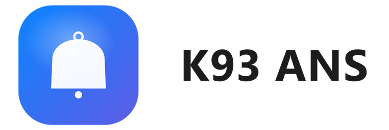

  <picture>
    <source media="(prefers-color-scheme: dark)" srcset="custom_components/k93_ans/brand/dark_logo.png">
    
  </picture>

# K93 Advanced Notification System for Home Assistant

A Home Assistant custom integration that centralizes notification handling: one entry point fans a
notification out to configurable recipients and channels, optionally requires acknowledgement via
the built-in persistent notification system, and keeps a JSON-backed history that a companion
Lovelace card can display.
